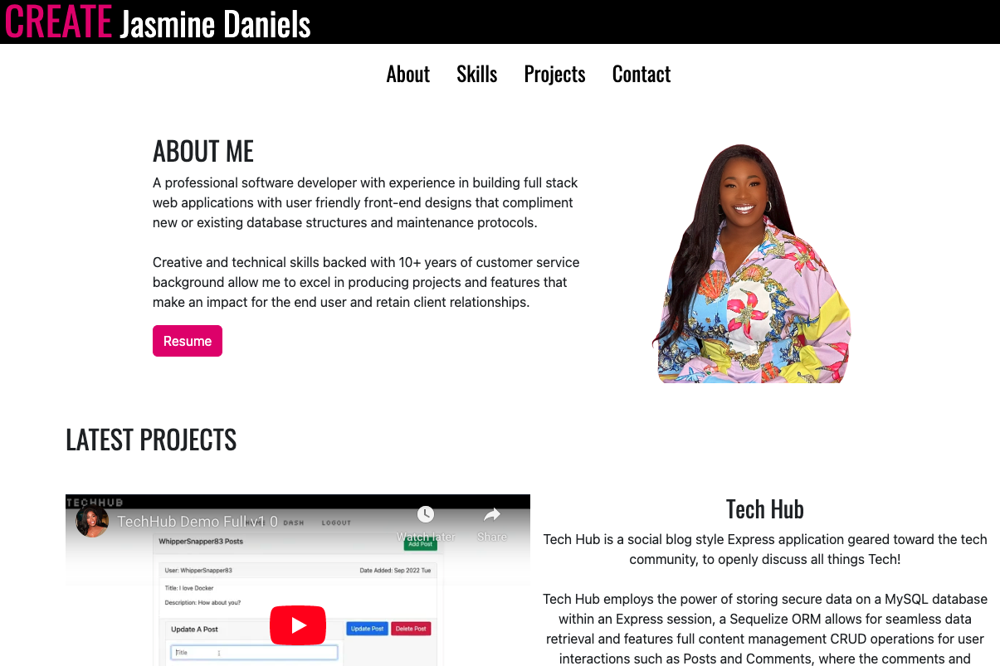

# CREATE Jasmine Daniels

Jasmine Daniels, A professional software developer with experience in building full stack web applications with user friendly front-end designs that compliment new or existing database structures and maintenance protocols.

Creative and technical skills backed with 10+ years of customer service background allow me to excel in producing projects and features that make an impact for the end user and retain client relationships.

Checkout my webiste below for my resume, my latest works, and more information about yours truly!

## [CREATE Jasmine Daniels Webpage](https://jasminedaniels.github.io/Portfolio-02/)

